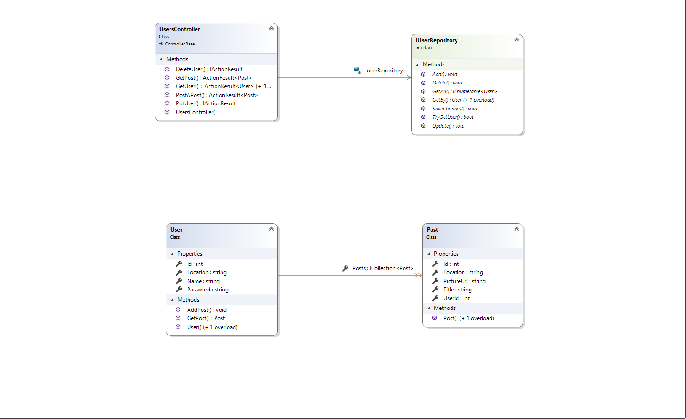

### 1920-C1-Ahmad Alhaj Karim

### Short brief
- This application is meant for home leftovers.
- Users can post a FREE leftover.
- Needers can reserve a leftover/s based on a close location.

### What i've done: 
https://github.com/Web-IV/1920-c1-be-AhmadAlhajKarim/blob/master/Requirements_backend.docx?raw=true

### DOMAIN CLASS DIAGRAM

### USERS API

### GET USER BY NAME

### GET USER BY ID

### DELETE USER

### GET A SINGLE USER POST

### ADD POST TO A USER

